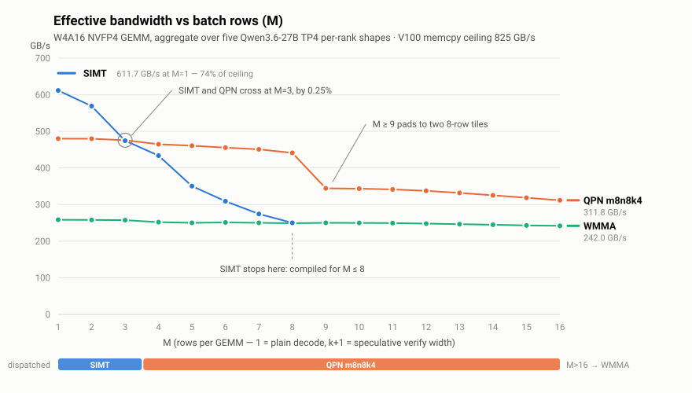

# v100-skinny

**Four Tesla V100 cards serve Qwen3.6-27B at up to 366 tokens each second.**

| Domain | tok/s | Profile |
|---|---:|---|
| extraction | **366.0** | k=15 |
| json | **243.4** | k=15 |
| csv | **204.0** | k=7 |
| math | **185.1** | k=7 |
| code | **170.6** | k=7 |
| prose | **88.1** | k=7 |

On structured output these four cards equal one **NVIDIA RTX 5090**. This stack gives **243.4 tok/s**
on the json domain. [ninfer](https://github.com/Neroued/ninfer), a purpose-built C++ engine on that
card, gives a published **243.1 tok/s**. The RTX 5090 has **native FP4 tensor cores**. The V100 has
**no 4-bit hardware at all**.

The stock NVFP4 path on SM70 falls back to the Marlin dequant kernel, and it gets **12%** of the
memory bandwidth of the card. The kernels in this project get **69%**.

This project supplies hand-written CUDA kernels for W4A16 NVFP4, and a serving stack with chain-MTP
speculation. The stack runs the Qwen3.6-27B NVFP4 checkpoint from NVIDIA bit-native. It is faster
than the reference serving stack for this hardware in **5 of the 6 domains**, and the largest lead is
**2.33×**.

The kernels and the serving profiles are the work here. They sit on
**[1Cat-vLLM](https://github.com/1CatAI/1Cat-vLLM)**, the vLLM fork that carries Volta support. That
fork supplies the speculative machinery and the SM70 route itself — see
[Acknowledgements](#acknowledgements).

| Component | Served |
|---|---|
| Model | Qwen3.6-27B (`nvidia/Qwen3.6-27B-NVFP4`) |
| Quantization | NVFP4 W4A16 — fp16 activations, fp32 accumulation |
| Hardware | 4× Tesla V100-SXM2-16GB (SM70, Volta) |
| Tensor parallel | 4 |
| Serving checkpoint | ~19.2 GB compressed-tensors + the 1.9 GB source lm_head shard (~22 GB resident) |

*Bit-native* is a specific claim. The sampled backbone MLP layers are **bit-equal** to the source
checkpoint, tensor for tensor. The lm_head reads the original 4-bit codes and scales of NVIDIA at
runtime, with zero requantization. The one exception is the FP8 attention and the FP8 GDN
projections, which the conversion down-converts because Volta has no FP8 hardware
([`docs/lmhead_provenance.md`](docs/lmhead_provenance.md)).

## The kernels

The table below shows the effective memory bandwidth of the W4A16 NVFP4 GEMM at **M=1 (decode)**. The
figure is the aggregate over the five real per-rank shapes of Qwen3.6-27B at tensor parallel 4. The
reference is the measured memcpy ceiling of this card, 825 GB/s. The data is in
[`results/kernel_bandwidth_20260811.csv`](results/kernel_bandwidth_20260811.csv), and the Marlin
reference is in [`results/nvfp4_flatness_results.csv`](results/nvfp4_flatness_results.csv):

| NVFP4 GEMM kernel | Effective bandwidth | % of memcpy ceiling |
|---|---|---|
| **This project (skinny SIMT)** | **565.2 GB/s** | **69%** |
| Stock Marlin (the NVFP4 fallback) | 96.0 GB/s | 12% |
| | **5.9× faster** | |

Marlin thus leaves **88%** of the memory bandwidth of the card unused.

Three kernels serve three M bands in the production dispatch: SIMT at M≤3, QPN at M=4–16, and WMMA at
M=17–64. The bandwidth of Marlin is almost flat with M: 96.0 at M=1, 94.4 at M=16, 92.9 at M=32 and
86.2 at M=64. Thus the ratio column uses its M=1 value of 96.0. The benchmark is
[`benchmarks/kernel_bw_bench.py`](benchmarks/kernel_bw_bench.py):

| M | Band | Kernel | Effective GB/s | % of ceiling | vs Marlin |
|---:|---|---|---:|---:|---:|
| 1 | decode | SIMT | 565.2 | 69% | 5.9× |
| 3 | decode | SIMT | 416.9 | 51% | 4.3× |
| 8 | spec verify (k≤7) | QPN m8n8k4 | 430.7 | 52% | 4.5× |
| 16 | spec verify (k≤15) | QPN m8n8k4 | 298.2 | 36% | 3.1× |
| 32 | batch | WMMA | 183.0 | 22% | 1.9× |
| 64 | batch | WMMA | 105.8 | 13% | 1.1× |

<picture>
  <source media="(prefers-color-scheme: dark)" srcset="docs/assets/m_sweep_dark.svg">
  
</picture>

The three curves have different shapes, and each kernel is the fastest in the band where its dataflow
is best. SIMT carries one row for each warp, and its bandwidth decreases when the activation
reuse decreases. QPN holds a flat bandwidth across its band. WMMA is flat and low, but it is the only
kernel that serves M>16. The measurements cover every kernel at every M in
[`results/kernel_m_sweep_20260812.csv`](results/kernel_m_sweep_20260812.csv), and
[`benchmarks/plot_m_sweep.py`](benchmarks/plot_m_sweep.py) draws the figure. The sweep is a later run
than the table above, on the tuned box, and it reads 2–14% higher; both CSVs record the difference.

**That flat band is what makes deep speculation pay on this hardware.** A k=7 round verifies 8
candidate tokens in one GEMM with 8 rows. The kernel moves the same weight bytes for 1 row and for 8
rows. The effective bandwidth falls only from **475.8 GB/s at M=3 to 441.3 GB/s at M=8**. The verify
GEMM of a full round thus costs about **8% more time than a single-token decode**, and it commits up
to 8 tokens. Every serving figure in this document rests on that property, because a kernel whose
cost grew with M would give the speculation nothing to win.

TurboMind is faster in the batch band above M=16. Three independent kernel efforts showed that the
WMMA plateau of the V100 is structural
([`docs/twin_race_notes.md`](docs/twin_race_notes.md)).

### The SIMT kernel: 69% of the copy ceiling at M=1

The SIMT path serves plain decode, and it is the fastest kernel here at M=1. Its shape is simple: 8
warps for each block, and one output row for each warp. For narrow K it gives each warp two rows
instead of one. At M=1 the GEMM only streams weights, so the problem is memory and not math.

**SIMT saturates both Volta issue pipes.** The nibble decode is integer work, and the MACs are fp16
HFMA2. Volta issues those on separate pipes, so the decode runs beside the MACs and not in front of
them. That overlap is why a kernel which dequantizes every weight still reaches 69% of the copy
ceiling. An int8 `dp4a` variant puts the MACs and their own unpack on the same pipe, and it loses
50–140% ([`docs/twin_race_notes.md`](docs/twin_race_notes.md)).

The decoder also matters. A shift-and-rebias decoder derived from TurboMind beats a PRMT lookup table
by about 28% at M=1. It has a shorter dependency chain and fewer INT-pipe operations for each value.
The first version of this kernel overflowed fp16 on real activation outliers. The fix folds the
global scale into the group scales in the kernel, and the kernel flushes to fp32 for each 16
elements.

### The QPN kernel: the one Volta tensor-core instruction, split on N

**The constraint.** Volta supplies exactly one FP16 tensor-core instruction, `mma.sync.m8n8k4`, and
it is difficult to feed. The warp splits into four quadpairs. Each quadpair does an independent 8×8×4
MMA against a fragment map that is local to the quadpair. Later architectures replaced the
instruction completely.

A skinny decode GEMM has a small M, and it is memory-bound on the weights. For that shape the
conventional WMMA path pads M to 16, and it becomes LSU-bound on the fragment loads.

**The insight: split N, not K.** The obvious decomposition gives each quadpair a slice of K, and it
reduces the four results at the end. QPN splits **N** instead. The A-fragment map depends only on the
lane position *inside* the quadpair. Thus the sibling lanes across the four quadpairs hold identical
A registers. One warp instruction thus issues four independent MMAs against the same 8×4 activation
fragment — an 8×32×4 step.

```
one warp, one mma.sync.m8n8k4 issue    (A = the 8-row activation tile)
  K-split (the killed B_ring)            N-split (QPN, shipped)
  QP0  A[·, k0:4 ] · B[k0:4 , n0:8]      QP0  A[·, k0:4] · B[k0:4, n0:8 ]
  QP1  A[·, k4:8 ] · B[k4:8 , n0:8]      QP1  A[·, k0:4] · B[k0:4, n8:16]
  QP2  A[·, k8:12] · B[k8:12, n0:8]      QP2  A[·, k0:4] · B[k0:4, n16:24]
  QP3  A[·, k12:16] · B[k12:16, n0:8]    QP3  A[·, k0:4] · B[k0:4, n24:32]
       4 A fragments, re-read 4×              1 A fragment, register-stationary
```

**What the N-split buys.** The activation traffic for each weight byte decreases **4×**. At M≤8 the
tile is a few kilobytes. Thus it moves from the L1/L2-resident global memory into the registers, and
it stays there. The main loop uses **no shared memory and no barriers at all**. The one barrier is
the K-reduction across the warps at the output.

**Two details keep the loop free of extra work.** The offline prepack interleaves the weight nibbles.
The `(i, i+4)` output of the dequantizer then lands exactly on the B-fragment register pair for the
adjacent k values, which the MMA expects. The loop needs **zero pack instructions**, against 8 for
each decode window when the kernel packs B-fragments at runtime. One FP8 group-scale register also
serves exactly the four MMAs of its group, because k=4 × 4 quadpairs is the group-16 quantization
granularity. The kernel uses **56 registers with zero spills**, and the grid (N/32) limits the
residency, not the kernel.

**The result: 1.94× the best previous kernel at M=8**, for 5 of 5 shapes, and 1.44× at M=5
([`results/qpn_race_20260810.csv`](results/qpn_race_20260810.csv)). Those figures are single-shape
race peaks without the dispatch overhead. The production figure is the aggregate above, 431–455 GB/s
across M=4–8, and the flat curve in the figure is this kernel.

**The instruction was written off once.** The v1 register-fragment path measured 200–360 GB/s. Its
postmortem named two causes: the DRAM scatter of the 8 rows, and a serial MMA chain. A direct test
examined both mechanisms and disproved them
([`kernels/research/register_gate.cu`](kernels/research/register_gate.cu)). The quadpair-N
decomposition is what made the instruction competitive. Full mechanics are in
[`docs/qpn_race_notes.md`](docs/qpn_race_notes.md).

## Serving

The measurements below use a single stream, and they decode only. The flagship profile is **k=7
chain-MTP, QPN dispatch, the native NVFP4 lm_head and a greedy drafter**. The structured endpoints
and the extraction endpoints use the k=15 profile. **τ** is the number of draft tokens that the stack
accepts in each speculative round. A round commits `1 + τ` tokens, and the round latency =
`(1 + τ) ÷ tok/s`.

| Cell | Plain (k=0) | **k=7 flagship** | τ | Round ms | k=15 profile | τ | Round ms |
|---|---:|---:|---:|---:|---:|---:|---:|
| prose (thinking off) | 91.2 | **88.1** | 1.48 | 28.2 | 60.4 | 1.40 | 39.8 |
| math (thinking on, 2048-capped) | 90.9 | **185.1** | 4.40 | 29.1 | 150.9 | 5.18 | 40.9 |
| code (thinking off) | 91.2 | **170.6** | 3.81 | 28.2 | 136.6 | 4.45 | 39.9 |
| json (thinking off) | 91.1 | **231.8** | 5.60 | 28.3 | **243.4** | 8.83 | 40.1 |
| csv (thinking off) | 91.2 | **204.0** | 4.79 | 28.2 | 188.6 | 6.60 | 39.9 |
| extraction (thinking off) | 90.9 | **263.7** | 6.92 | 29.9 | **366.0** | 14.61 | 42.4 |

These rows are greedy, and they use temperature 0. The sampling that Qwen recommends (temp 0.6, top-p
0.95, top-k 20) costs 8–16% by domain
([`results/temp_sweep_20260812.csv`](results/temp_sweep_20260812.csv)). The rows are the NUMA-pinned
launch anchors: the TP workers and their memory bind to socket 0, where all four GPUs connect. This
bind removed a ±3% change of the round time between boots, and it improved on the best earlier
sitting in every k=7 cell.

The measured rows, the served configuration and the boot gates for this anchor are in
[`results/launch_anchors_pinned_20260812.csv`](results/launch_anchors_pinned_20260812.csv).

## Evaluation

**[1Cat](https://github.com/1CatAI/1Cat-vLLM)** is the reference serving stack for this hardware, and
it is also the fork that this project builds on ([Acknowledgements](#acknowledgements)). It runs
QuantTrio/Qwen3.6-27B-AWQ through the TurboMind SM70 production route, at the k=4 MTP profile that it
ships. Both columns therefore run on
the same fork, and the table compares two routes inside one codebase:

| Domain | This stack | Profile | 1Cat (AWQ, k=4) | Lead |
|---|---:|---|---:|---:|
| prose | 88.1 | k=7 | 86.3 | 1.02× (τ-band 0.95–1.02×) |
| math | **185.1** | k=7 | 126.9 | **1.46×** |
| code | **170.6** | k=7 | 133.0 | **1.28×** |
| json | **243.4** | k=15 | 150.6 | **1.62×** |
| csv | **204.0** | k=7 | 118.8 | **1.72×** |
| extraction | **366.0** | k=15 | 156.9 | **2.33×** |

This stack wins five of the six domains. Prose is the domain with the lowest acceptance, so a deep
speculative round gives almost no gain there. Its near-tie band contains the 1Cat number.

Two backstops remove the profile advantage. At a matched k=7, with an fp16-class lm_head on both
sides, this stack wins 3 domains, ties 2 and loses 1. With no speculation on either side, plain
decode is **86.6 tok/s against 70.7 tok/s**
([`results/broad_flagship_compare.csv`](results/broad_flagship_compare.csv),
[`results/plain_decode_compare.csv`](results/plain_decode_compare.csv)).

### Against ninfer, on a single RTX 5090

[ninfer](https://github.com/Neroued/ninfer) is a purpose-built C++ inference engine. It runs the
**same Qwen3.6-27B NVFP4 model** on one 32 GB RTX 5090, a consumer Blackwell card with native FP4
tensor cores. Both sides use the same conventions: decode-only tok/s, and acceptance = accepted ÷
drafted.

Four V100 cards hold parity on the decode path:

- **Structured decode**: **243.4 tok/s** at k=15 on json, against a published **243.1 tok/s**.
  Extraction at **366.0 tok/s** belongs to this stack only. ninfer reports no such cell.
- **Plain decode**: **86.6–91.2 tok/s**, against a published **86.4 tok/s**.
- **Acceptance at a matched configuration**: at k=3 with an fp16 lm_head, seeded ×3 on the fixtures
  of ninfer, f01 gives **83.4 ± 0.6%** against **80.8 ± 1.8%**.

ninfer wins the prefill by **~4×**, from native FP4 W4A4 flops. It also wins the long reasoning,
where this stack runs at **0.79×** its rate. Those rows use the thinking mode and sampling, not the
greedy regime of the tables above:

| aime26_01 | This stack (k=7, native lm_head) | ninfer (MTP3, n=5) |
|---|---:|---:|
| Decode tok/s | 175.5 (replicated 174.8) | **222.7 ± 3.4** |
| Tokens for each round (1 + τ) | **5.31** | 3.43 |
| Round latency (derived) | 30.3 ms | **15.4 ms** |
| Acceptance | 61.6% at k=7 | 80.8 ± 1.8% at k=3 |
| Completion length | 8000–8073 tok | 11717 ± 477 tok |

**The speculation here commits more tokens for each round than ninfer, 5.31 against 3.43, and this
stack is still slower.** The engine of ninfer turns a round in **15.4 ms**, and this stack needs
**30.3 ms**. The deficit is engine round latency, which is the host orchestration of the drafter
chain. It is not the acceptance, and it is not the matrix throughput. Only aime26_01 is a clean
comparison, because the longer fixtures exceed the serving context here.

[`docs/benchmarks.md`](docs/benchmarks.md) holds the full matrices, the AIME 2026 fixtures, the batch
crossover and the thinking-mode matrix. Every harness prints the losslessness diff against plain
decode at a matched configuration, together with the throughput. The acceptance metrics alone cannot
show the difference between speed and corruption.

## Requirements

- 4× Tesla V100-SXM2-16GB (SM70) or equivalent, tensor parallel 4
- CUDA 12.8 (`CUDA_HOME=/usr/local/cuda-12.8`, `TORCH_CUDA_ARCH_LIST=7.0`)
- torch **2.10.0+cu128**
- **[1Cat-vLLM](https://github.com/1CatAI/1Cat-vLLM) 1.2.2**, from a wheel install (no source checkout)
- `tilelang` / `apache-tvm-ffi` at **0.1.10** — this version has the SM70 TileLang compile fix
- conda (the reference env is `1cat-vllm-122`, Python 3.12)
- ~22 GB disk for the serving checkpoint and the source lm_head shard
- The harness deps in [`requirements.txt`](requirements.txt): `torch>=2.10`, `safetensors>=0.4`, `numpy>=1.26`

## Install

Copy the fork changes onto the wheel install. Keep a backup of each file that you replace. Never edit
an installed file in place.

```bash
SP=~/miniconda3/envs/1cat-vllm-122/lib/python3.12/site-packages
cp $SP/vllm/model_executor/kernels/linear/nvfp4/marlin.py{,.orig}   # keep the backup
cp fork_patches/marlin.py           $SP/vllm/model_executor/kernels/linear/nvfp4/
cp fork_patches/gdn_attn.py         $SP/vllm/v1/attention/backends/
cp fork_patches/gpu_model_runner.py $SP/vllm/v1/worker/
cp kernels/skinny_kernels.cu        ~/flatness-run/
```

The CUDA kernels JIT-compile from [`kernels/skinny_kernels.cu`](kernels/skinny_kernels.cu) at the
first boot. Set `VLLM_SKINNY_NVFP4_SRC` to the path of that file. There is no build step, and the
first three eager calls check themselves numerically against Marlin.
[`fork_patches/README.md`](fork_patches/README.md) gives the install targets and the backup names.
[`docs/REPRODUCE.md`](docs/REPRODUCE.md) gives the full procedure.

## Download and convert the model

```bash
huggingface-cli download nvidia/Qwen3.6-27B-NVFP4 --local-dir ~/models/Qwen3.6-27B-NVFP4
```

Volta cannot serve the NVIDIA export in its published form. Its FP8 attention and its FP8 GDN
projections have no hardware path on SM70, and the skinny dispatch connects to the W4A16 scheme of
compressed-tensors. Thus one conversion down-converts those layers to NVFP4, and it writes the
checkpoint again as compressed-tensors:

```bash
CONV_OUT=~/models/Qwen3.6-27B-NVFP4-CTfull CONV_DEV=cuda:0 \
  python scripts/convert_modelopt_to_ct.py
```

The converter supplies its own CT config template
([`scripts/ct_config_template.json`](scripts/ct_config_template.json)). Thus you need only the NVIDIA
checkpoint and this repository. After the conversion, the runtime reads only
`model-00003-of-00003.safetensors` (1.9 GB) of the source. The native lm_head reads the original
4-bit codes and scales of NVIDIA from that file at every boot, so keep this one file. The other two
source shards (18.6 GB) are input to the conversion only, and you can remove them. The serving
footprint is ~22 GB.

If you move the shard, set `VLLM_SKINNY_LMHEAD_NATIVE` to its new path.

## Run the server

```bash
VLLM_SKINNY_NVFP4=1 VLLM_SKINNY_QPN=1 VLLM_SKINNY_LMHEAD=1 VLLM_SKINNY_LMHEAD_NATIVE=1 \
VLLM_SM70_MTP_DYNAMIC_DRAFT_VOCAB_DEFAULT=0 VLLM_SM70_GDN_CHAIN_SPEC_FAST_BUILD=1 \
MNS=1 GMU=0.93 MBT=4096 \
EXTRA_VLLM_ARGS='--default-chat-template-kwargs {"enable_thinking":true} --reasoning-parser qwen3
  --enable-auto-tool-choice --tool-call-parser hermes
  --compilation-config {"cudagraph_capture_sizes":[8,16]}
  --speculative-config {"method":"mtp","num_speculative_tokens":7,"draft_sample_method":"greedy","use_local_argmax_reduction":true}' \
bash scripts/launch_qwen36_ctfull_mtp.sh
```

The OpenAI-compatible endpoint answers on `:8000`:

```bash
curl http://127.0.0.1:8000/v1/chat/completions \
  -H 'Content-Type: application/json' \
  -d '{"model":"qwen3.6-27b-nvfp4-skinny",
       "messages":[{"role":"user","content":"Extract every date and amount from this invoice."}],
       "temperature":0}'
```

The structured endpoints and the extraction endpoints use the k=15 profile instead. Set
`num_speculative_tokens=15`. Set `cudagraph_capture_sizes=[16,32,64]`. Set `VLLM_SKINNY_DROP_CT=1`.
Set the thinking mode to off. [`docs/DEPLOYMENT.md`](docs/DEPLOYMENT.md) is the authority on the
launch config, the environment flags, the memory envelopes, the profile for each domain and the gates
after the boot.

## Capabilities

- An OpenAI-compatible server: `/v1/chat/completions` and `/v1/completions`, streaming, TP4
- Chain-MTP speculative decoding at k ≤ 15, with greedy (argmax) drafter proposals
- The thinking mode with the `qwen3` reasoning parser — set it for each endpoint, each request or each chat
- Tool calls through the `hermes` parser with `--enable-auto-tool-choice`
- The native NVFP4 lm_head: the stack reads the original NVIDIA codes and scales for each rank, with zero requantization
- A serving profile for each domain — k=7 for general work, k=15 for structured output and extraction

## Current limits

- `num_speculative_tokens ≤ 15` is a hard limit. The cause is the 16-query tile of the V100
  flash-decode. At k ≥ 16 the output is degenerate every time
  ([`docs/mtp_width_findings.md`](docs/mtp_width_findings.md))
- TurboMind is faster in the batch band above M=16, which is 8 or more concurrent streams. The
  crossover is at ~4–8 streams
- The native speculative round with one launch is complete and safe for the output, but it is inert.
  The captured graph does not keep the recurrent state of the drafter, the stack rejects the drafts,
  and the gain of ~5 ms stays unrealized
- The conversion down-converts the attention `q/k/v/o` (16 layers) and the GDN `out_proj` (~48
  layers) from the FP8 of NVIDIA to NVFP4. Those layers are thus a derivative with more
  quantization, because the V100 has no FP8 hardware
- The fp16 activations with the fp32 accumulation are not a native FP8 execution. This arithmetic is
  stronger than the checkpoint intends, and it is numerically different from it
- τ changes between runs on the high-entropy domains (prose 1.33–1.48, math 4.40–4.41, json
  5.56–5.60). Thus the prose decode changes between 82 and 88 tok/s

## Documentation

- [`docs/benchmarks.md`](docs/benchmarks.md) — the full benchmark matrices and the head-to-head comparisons
- [`docs/DEPLOYMENT.md`](docs/DEPLOYMENT.md) — the launch config, the flags, the profiles, the ops hardening
- [`docs/REPRODUCE.md`](docs/REPRODUCE.md) — how to measure every headline number again
- [`docs/ab_report.md`](docs/ab_report.md) — NVFP4 + skinny against AWQ + TurboMind
- [`docs/acceptance_gap_notes.md`](docs/acceptance_gap_notes.md) — the acceptance fix for the greedy drafter
- [`docs/lmhead_provenance.md`](docs/lmhead_provenance.md) — the weight provenance and the FP8 deviation
- [`docs/mtp_width_findings.md`](docs/mtp_width_findings.md) — the correctness wall at the k ≤ 15 verify width
- [`docs/qpn_race_notes.md`](docs/qpn_race_notes.md) — the Volta-native `m8n8k4` tensor-core path
- [`docs/twin_race_notes.md`](docs/twin_race_notes.md) — why the batch band stays closed
- [`docs/native_round_design.md`](docs/native_round_design.md) — the speculative round in one CUDA graph
- [`docs/decode_residual_ledger.md`](docs/decode_residual_ledger.md) — the decode cost for each step
- [`docs/hardware_audit.md`](docs/hardware_audit.md) — the NUMA placement, the clocks, the C-state findings
- [`docs/terminology_audit.md`](docs/terminology_audit.md) — the lm_head / mtp_head / backbone vocabulary

The code is in [`kernels/`](kernels), [`fork_patches/`](fork_patches),
[`benchmarks/`](benchmarks), [`scripts/`](scripts) and [`tests/`](tests). The retired experiments are
in `kernels/research/`. Every headline number comes from a committed CSV in [`results/`](results).

## Acknowledgements

**This is not a standalone engine.** It is a set of CUDA kernels and a serving configuration on top
of **[1Cat-vLLM](https://github.com/1CatAI/1Cat-vLLM)**, the
[vLLM](https://github.com/vllm-project/vllm) fork that carries Volta (SM70) support. This repository
is separate, and it is not a GitHub fork, so nothing in the interface shows that lineage.

The fork supplies the SM70 NVFP4 route, and the kernels here only replace the GEMM inside it. It also
supplies the chain-MTP machinery that every speculative figure runs on, and the fast path that
[`fork_patches/`](fork_patches) extends. The acceptance flag `draft_sample_method=greedy` came from
the fork too. This project measured what that flag was worth, and it did not build it.

Thanks also to NVIDIA and Qwen for the
[checkpoint](https://huggingface.co/nvidia/Qwen3.6-27B-NVFP4). TurboMind / LMDeploy supplied the
`cvt_f16x8_e2m1` decoder, which [`kernels/skinny_kernels.cu`](kernels/skinny_kernels.cu) derives from
under Apache-2.0. QuantTrio supplied the AWQ checkpoint of the reference arm.
[ninfer](https://github.com/Neroued/ninfer) published numbers and fixtures that another project can
reproduce.

## Provenance

This repository is a curated release. The work happened in a private research archive. At the
release, the final state of that archive is 103 commits (2026-08-10 → 2026-08-12) with the HEAD
`089407ae92e2afd431eae3628b6b5bf97bb33925`. Those commits sit on top of the earlier on-box
measurement campaigns that the CSVs in `results/` record. A git commit hash is a cryptographic
commitment to the complete history behind it. Thus the author can supply the archive for verification
without a public release.

## License

MIT for this repository ([`LICENSE`](LICENSE)). The files in [`fork_patches/`](fork_patches) modify
vLLM and 1Cat-vLLM sources. They stay under **Apache-2.0** and keep their SPDX headers.
